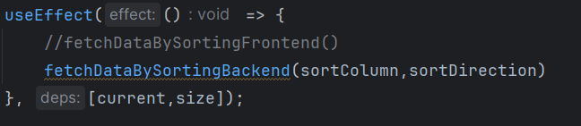

# Start Here

1. Use this template repository to create a private fork (click the green `Use this template` button and not the `Fork` button).
1. Follow the instructions in `INSTRUCTIONS.md`.
1. Give [@mersive-asavchenko](https://github.com/mersive-asavchenko) (`asavchenko@mersive.com`) and [@retronouns](https://github.com/retronouns) (`cgingles@mersive.com`) collaborator access when complete.
1. Inform your Mersive contact that the assignment is complete.

# Your Documentation
## Table of Contents

1. [Getting Started](#getting-started)
    - [Prerequisites](#prerequisites)
    - [Server Setup](#server-setup)
    - [Client Setup](#client-setup)
    - [Postman Collection](#postman-collection)
2. [Project Structure](#project-structure)
    - [Backend](#backend)
    - [Folder Structure](#folder-structure)
    - [Change sorting algorithm to the frontend side](#change-sorting-algorithm-to-the-frontend-side)
3. [Screenshots & Videos of the project](#screenshots--videos-of-the-project)

## Getting Started

### Overview
This project supports two endpoints which is `http://localhost:4000/devices` and `http://localhost:4000/devices-with-sorting`. Both endpoints are the standard RESTful API endpoint to get all devices information which are included firmware versions, users admin status, last updated date, email and device name. The only difference between them is one of them supports sortable & pagination features in the backend and the other one only supports pagination in the backend. The idea behind this is to prove that I'm able to handle pagination and sorting on both the backend and frontend.
> To simulate the real world scenario, I've worked with the branches most of the time and used conventional naming standards for commits. 

**What I have done**
- I've reorganized the project structure to make it more readable and maintainable.
- I've created a new endpoint to support sorting and pagination on both the backend and frontend.
- I've generalized response structure to make it more readable and maintainable.
- I've created a handler for 404 errors for endpoints that do not exist.
- I've managed errors which are thrown by the backend in the frontend, such as "Page not found" etc.


### Prerequisites
- Node.js (version 14 or later recommended)
- npm (Node Package Manager) / yarn 
- SQLite3 database

### Server Setup
> In package.json file, the server is configured to run some sql scripts to create the database and populate it with some data. Due to local environment differences you may need to change the scripts in the package.json file. 
1. Navigate to the project root directory, install dependencies by running:
   ```bash
   npm install
2. Start the server by running:
   ```bash
   npm run serve
### Client Setup
1. Navigate to the project root directory.
2. Start the server by running:
   ```bash
   npm run start
   
### Postman Collection

```
{
	"info": {
		"_postman_id": "3c663ac3-e757-4766-893b-72cc45fdeb63",
		"name": "interview-cloud-full-stack",
		"schema": "https://schema.getpostman.com/json/collection/v2.1.0/collection.json",
		"_exporter_id": "14075793"
	},
	"item": [
		{
			"name": "http://localhost:4000/devices",
			"request": {
				"method": "GET",
				"header": [],
				"url": {
					"raw": "http://localhost:4000/devices?page=1&pageSize=10",
					"protocol": "http",
					"host": [
						"localhost"
					],
					"port": "4000",
					"path": [
						"devices"
					],
					"query": [
						{
							"key": "page",
							"value": "1"
						},
						{
							"key": "pageSize",
							"value": "10"
						}
					]
				}
			},
			"response": []
		},
		{
			"name": "http://localhost:4000/devices-with-sorting?sortColumn=status&sortDirection=desc&page=1&pageSize=50 Copy",
			"request": {
				"method": "GET",
				"header": [],
				"url": {
					"raw": "http://localhost:4000/devices-with-sorting?sortColumn=status&sortDirection=desc&page=11&pageSize=50",
					"protocol": "http",
					"host": [
						"localhost"
					],
					"port": "4000",
					"path": [
						"devices-with-sorting"
					],
					"query": [
						{
							"key": "sortColumn",
							"value": "status"
						},
						{
							"key": "sortDirection",
							"value": "desc"
						},
						{
							"key": "page",
							"value": "11"
						},
						{
							"key": "pageSize",
							"value": "50"
						}
					]
				}
			},
			"response": []
		}
	]
}
```
   
## Project Structure

### Backend
- `http://localhost:4000/devices` - Standard RESTful API endpoint to retrieve all device information, including firmware versions, user admin status, last updated date, email, and device name. Support pagination.

  | Query Parameters | Description                                 | Is Required | Value Type | Min |
  |------------------|---------------------------------------------|-------------|------------|-----|
  | page             | This is the page number for paginating data | no          | number     | 1   |
  | pageSize         | This is the item size for per page          | no          | number     | 10  |

- `http://localhost:4000/devices-with-sorting` - Standard RESTful API endpoint to get all devices information which is included firmware versions, users admin status, last updated date, email and device name. Support sorting by columns and pagination.

  | Query Parameters | Description                                                                           | Is Required | Value Type | Min |   |
  |------------------|---------------------------------------------------------------------------------------|-------------|------------|-----|---|
  | page             | This is the page number for paginating data                                           | no          | number     | 1   |   |
  | pageSize         | This is the item size for per page                                                    | no          | number     | 10  |   |
  | sortColumn       | This is parameter for sorting by columns which is support all the fields in the table | no          | string     | -   |   |
  | sortDirection    | This is parameter for sorting column by "DESC" or "ASC"                               | no          | string     | -   |   |

### Folder structure

- **src/components/**: This directory will hold all the reusable UI components.
- **src/libs/**: Contains helper files such as constants, fetch utilities, and other general-purpose utility functions.
- **src/server/configs/**: Holds configuration-related files.
- **src/server/controllers/**: Contains the logic for handling device-related actions and managing exceptions.
- **src/server/sql/**: Contains SQL scripts for database setup and seeding.
- **src/server/utils/**: Utility files for managing database connections, handling GraphQL and REST API, and schema management.
- **App.js**: The main entry point for the React application.
- **index.css**: The main stylesheet for the application.
- **index.js**: The main JavaScript entry point.

This structure is designed to keep the project modular, making it easy to scale and maintain.

### Change sorting algorithm to the frontend side
To achieve this, you just need to replace *"fetchDataBySortingFrontend"* function instead of *"fetchDataBySortingBackend"* function in two places App.js. One of them sort function, other one is in the useEffect function.




### Screenshots & Videos of the project


[Watch the video](https://www.youtube.com/watch?v=Hvph_91RxlQ)

